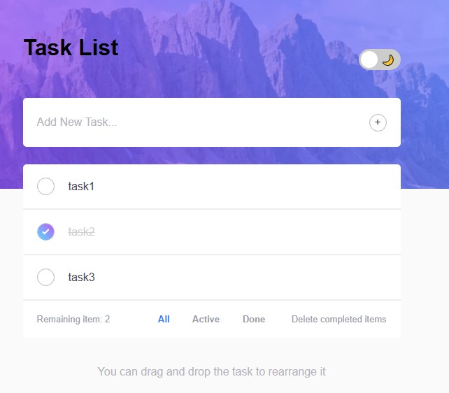

# ✅ TodoProApp

**TodoProApp** is a sleek and responsive to-do list application built using **HTML, CSS, and JavaScript**.
It provides a smooth user experience with features 
like **drag and drop task reordering**, **dark/light mode themes**, and **local storage** to keep
your tasks saved even after refreshing or closing the browser.

---

## ✨ Features

- 🌓 **Dark & Light Mode**  
  Toggle between dark and light themes with a single click. The theme preference is stored using `localStorage`.

- 🖱️ **Drag and Drop Reordering**  
  Reorder tasks easily by dragging and dropping them to your desired position.

- 💾 **Local Storage Integration**  
  All tasks and settings are saved in the browser’s local storage — no backend or database required.

- ✅ **Task Management**  
  - Add new tasks  
  - Mark tasks as completed  
  - Delete individual tasks  
  - Filter tasks: All / Active / Completed

- 📱 **Fully Responsive**  
  Optimized for both desktop and mobile devices.

---
## 📸 Demo


## 🚀 Getting Started

### 1. Clone the repository or download the ZIP file:

```bash
git clone https://github.com/your-username/TodoProApp.git
cd TodoProApp/TodoProApp
